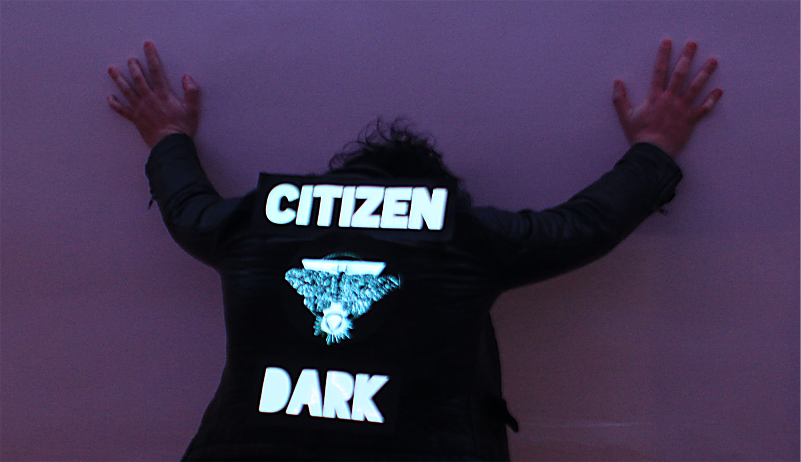

Citizen Dark
===

The moth portion of the patch is based on the 
image of a *Dryocampa imperialis* from the 1891 book
['Among the moths and butterflies: a revised and enlarged edition of "insect lives ; or, Born in prison"'](https://archive.org/details/amongmothsbutter00balluoft/page/122) by Julia P. Ballard (Julia Perkins).

The basis for the lunar eclipse was taken from the 1881 book
["Les merveilles celestes, lectures du soir"](https://archive.org/details/lesmerveillesc00flam/page/328) by Camille Flammarion.

The lettering is done with the [Blackout](https://www.theleagueofmoveabletype.com/blackout) font coutesy of the League of Moveable Type
and is available under the [Open Font License](https://github.com/theleagueof/blackout/blob/master/Open%20Font%20License.markdown).

License
---

Creative Commons Zero ([CC0](https://creativecommons.org/share-your-work/public-domain/cc0/))

Please use this design, art and all source files in this directory as you wish.
Credit is appreciated but not necessary.

References
---

* ['Among the moths and butterflies: a revised and enlarged edition of "insect lives ; or, Born in prison"' (pg. 122)](https://archive.org/details/amongmothsbutter00balluoft/page/122) by Julio P. Ballard (Julia Perkins).
* ["Les merveilles celestes, lectures du soir" (pg. 328)](https://archive.org/details/lesmerveillesc00flam/page/328) by Camille Flammarion.
* [Dryocampa imperialis](http://dpr.ncparks.gov/moths/view.php?MONA_number=7715.00)
* [Blackout font by The League of Moveable Type](https://github.com/theleagueof/blackout)
