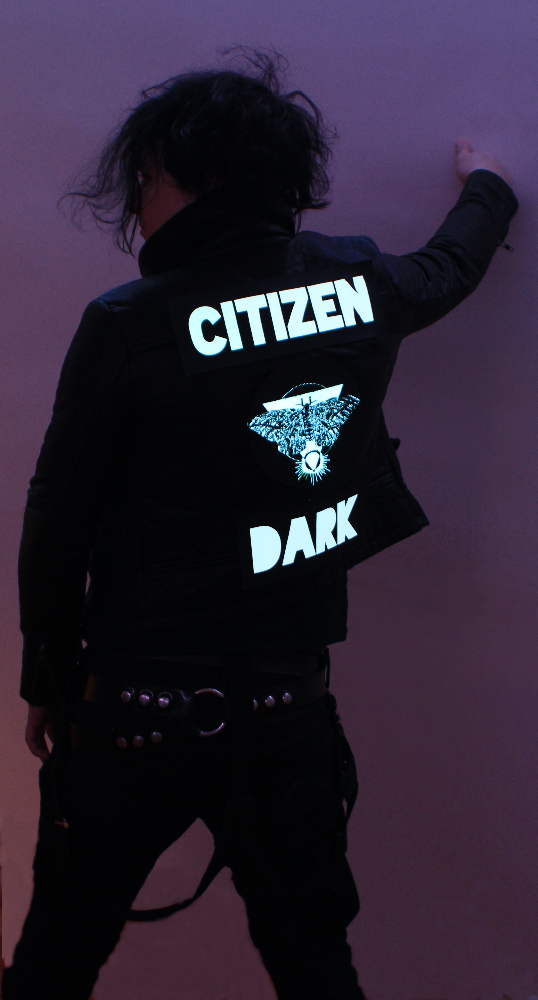
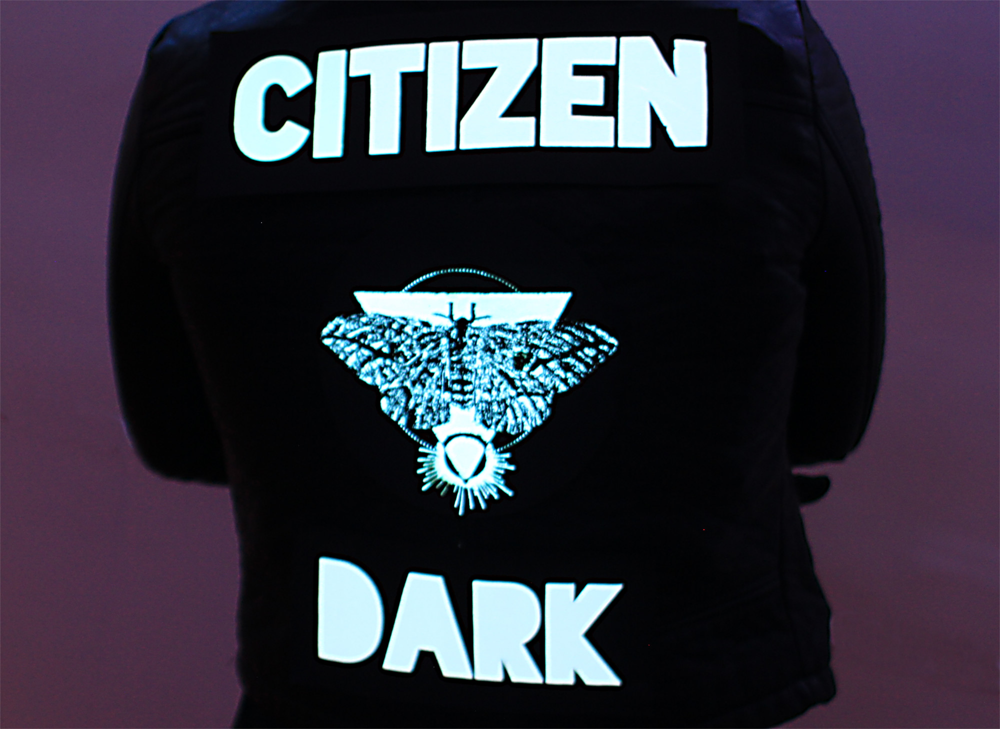
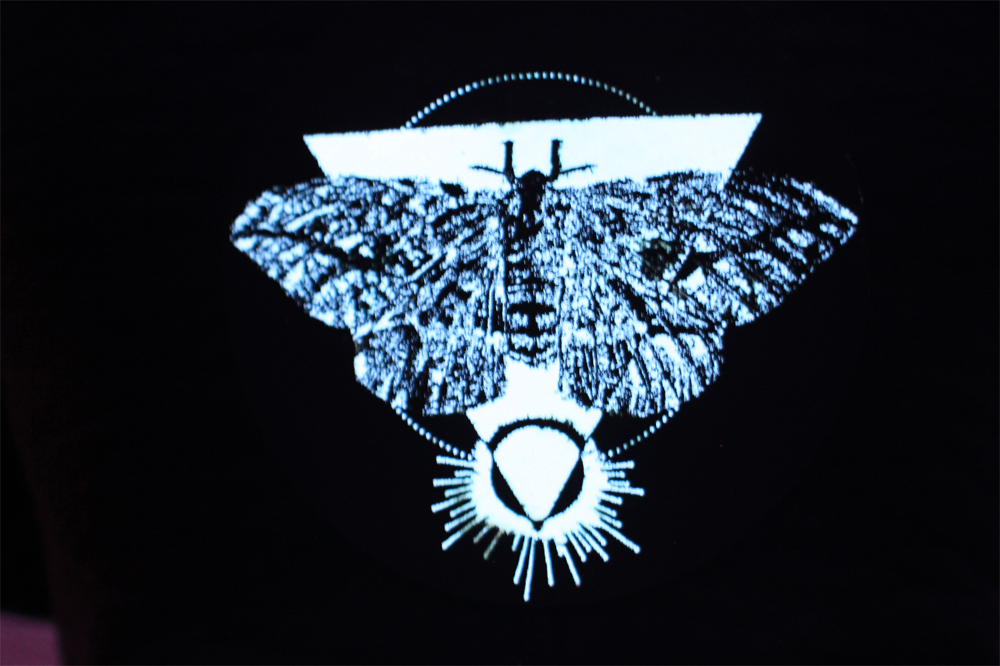
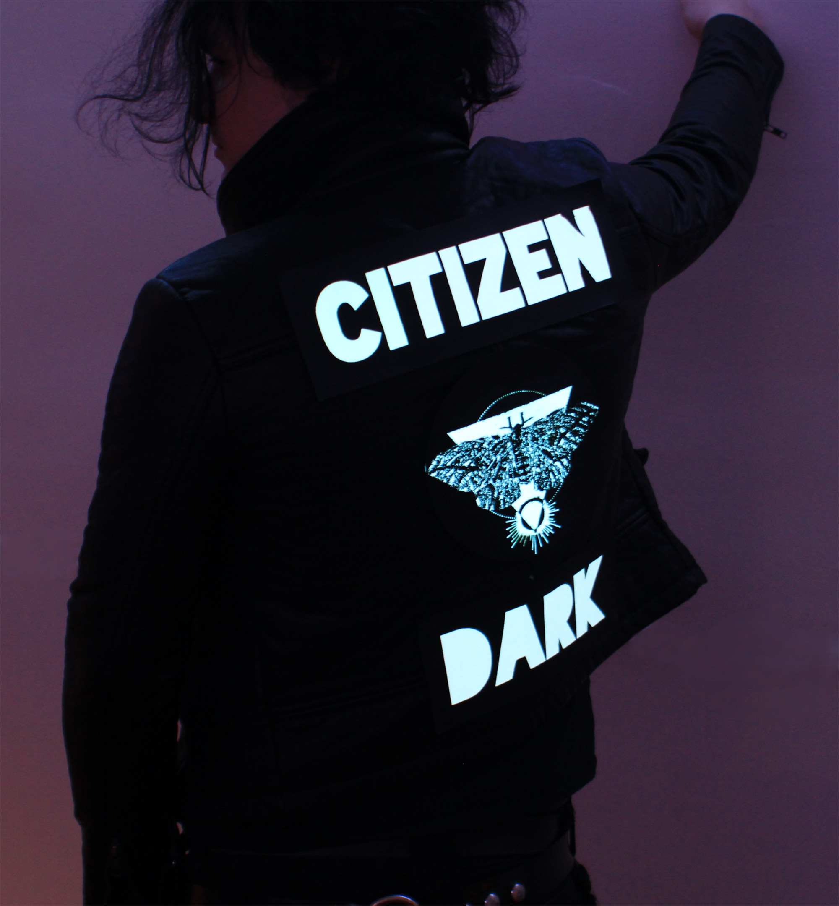
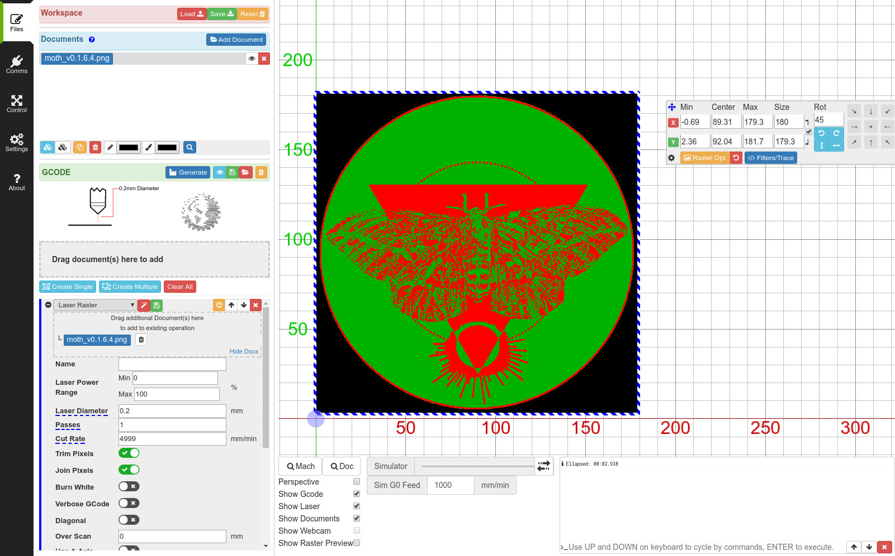
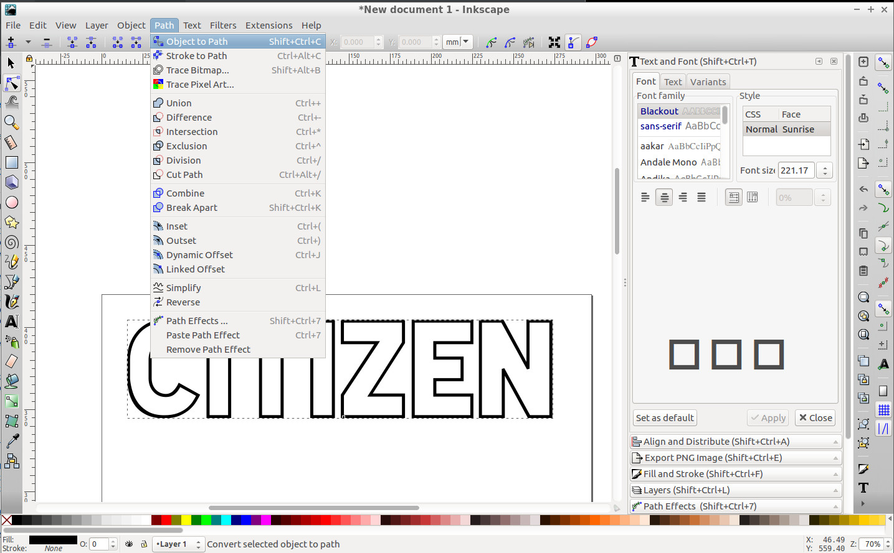
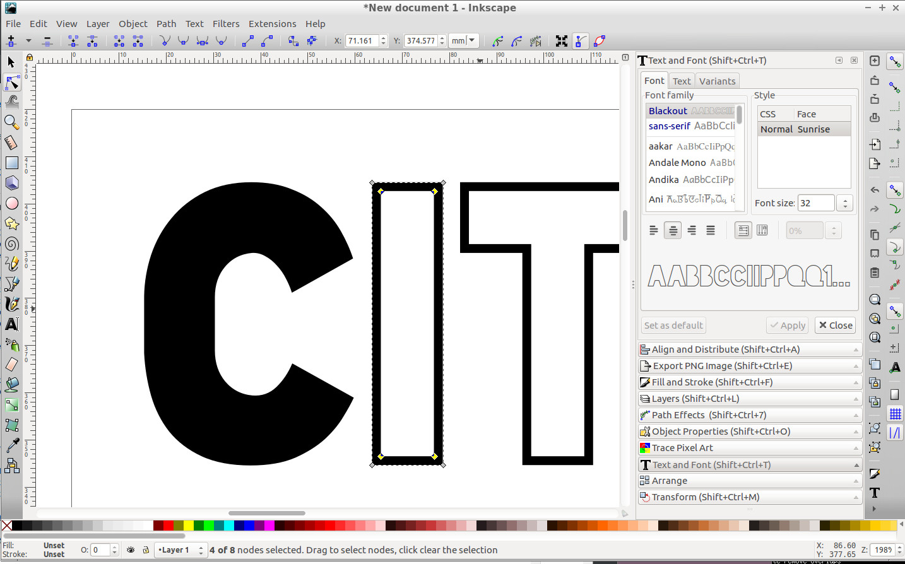

Cyberpunk Jacket
===

| | |
|---|---|
|  |  |
|  |  |

Introduction
---

In order to try and make aesthetically pleasing high tech
fashion more available, we came up with the idea of
creating electroluminescent (EL) patches that can be put
on clothing.
The EL patch glows in the dark and gives a very retro "cyberpunk" feel to jacket.
Though high tech fashion is becoming more mainstream,
there's a lack of stylish clothing that's reasonably
priced.
This project is an attempt to make visually pleasing wearables
more accessible to the public.

The method is versatile enough that you can affix the EL patches
to other pieces of clothing but this instrucatble will focus
on making EL patches just for jackets.

The total cost is roughly $100, $50 in EL panels, $30 for
the jacket and the rest for miscellaneous cost, such as the
cloth, glue, etc.

The method described in this instrucable will be focused
on the workflow used to create the EL panels but can
be altered depending on what kind of access to materials,
software and machines you have.

The basic idea is to laser cut some art, glue it
to an EL panel and then affix it to a jacket with velcro.
The wires are poked through the back of the jacket and wired
through the lining to access the power source
in the jacket pocket.
The patches are semi flexible and act like standard jacket patches.

The patches on the jacket are a bit fragile but can withstand "everyday"
usage.
Protetecting the panels from breakage is an ongoing experiment
and the current methods presented below, such as strain relief, are
our current attempts at making the panels more robust against everyday
use.

Even though the idea is pretty simple the results look striking.

Step 0 : Materials and Tools
---

* Access to a laser cutter (for cutting the cloth patches) (We use a [K40 40W CO2 laser engraver](https://www.ebay.com/bhp/40w-laser) modified with a [smoothieboard](http://smoothieware.org/smoothieboard) to control the motors and laser).
* Cloth (heavy duty nylon) ([Amazon link](https://www.amazon.com/gp/product/B002C6DAXE/))
* 3 EL panels, 1 A4 size (300mmx210mm) and two A5 size (210mmx150mm) ([Ebay A4 link](https://www.ebay.com/itm/12V-A4-EL-Panel-Electroluminescent-Cuttable-Light-With-Inverter-Paper-Neon-Sheet/292622036778), [Ebay A5 link](https://www.ebay.com/itm/White-A5-EL-Panel-Electroluminescent-Cuttable-Sheet-Neon-Paper-12V-Actuator-US/362404815900))
* EL Extension wires and splitters ([Ebay EL wire extension link](https://www.ebay.com/itm/15-2-way-EL-Wire-Splitter-Cable-Connector-Extension-Line-Decorative-Black-Red/382637753018), [Ebay splitter link, 5way](https://www.ebay.com/itm/5-way-EL-Wire-Splitter-Extension-Cable-Line-Decor-Tool-Female-Connector-Black/312253408137))
* inverter plus batteries and battery pack ([Ebay link](https://www.ebay.com/itm/New-12v-Battery-Box-inverter-for-15-Meters15M-EL-Wire-EL-Panel-EL-Tape-XMAS/322616309101))
* Glue (gorilla) ([Amazon link](https://www.amazon.com/Gorilla-Original-Waterproof-Polyurethane-Bottle/dp/B0000223UV))
* Jacket (Take your pick but we used a Forever 21 cropped faux leather jacket, [example link](https://poshmark.com/listing/Forever-21-Faux-Leather-Jacket-5c326999534ef9b07b6658c3))
* Velcro (heavy duty) ([Amazon link](https://www.amazon.com/VELCRO-Brand-Industrial-Strength-Superior/dp/B00006RSP1))
* Scissors

* Soldering Iron
* (optional) 'helping hands'
* Solder
* (optional) solder flux
* (optional) 1/16" thick Delrin or Acetal for strain relief ([Amazon link](https://www.amazon.com/Acetal-Copolymer-Standard-Tolerance-Thickness/dp/B0070ZYI0Q))
* (optional) M2 bolts and nuts, at least 8mm in length (longer is ok) ([Amazon link](https://www.amazon.com/Hilitchi-600-Piece-Phillips-Assortment-stainless/dp/B01N2XYON0))
* (optional) M2 screwdriver
* (optional) blue loctite ([Amazon link](https://www.amazon.com/Loctite-Heavy-Duty-Threadlocker-Single/dp/B000I1RSNS/))

Note that you can use any material for the cloth but not all material
is safe to laser cut.
[Pololu's materials for laser cutting](https://www.pololu.com/docs/0J24/3)
and [ATX Hackerspaces Laser Cutter Materials](http://atxhackerspace.org/wiki/Laser_Cutter_Materials)
are good resources to make sure the material you're laser cutting is safe.
In particular, PVC, vinyl and pleather are all materials that will emit toxic chlorine
gas if laser cut and should be avoided.
Cotton, polyester, nylon, acetal and Delrin are all materials that are able to be cut safely on
the laser cutter.

The cloth above is heavy duty Nylon.
Though Nylon melts in the laser cutter, it's still able to retain a lot of the detail
of the source image.
Since Nylon melts, this helps a bit as it cauterizes the edge of the fabric, where it
cuts, to make a nice seal.

### Software

The software is optimized for the workflow we've developed but other software
can be used depending on what you're familiar with or what kind of laser cutter
you have access to.

* [Inkscape](https://inkscape.org/)
* [Gimp](https://www.gimp.org/)
* [LaserWeb4](https://github.com/LaserWeb/LaserWeb4-Binaries/)

Inkscape is used to create the vector art for the lettering.
Gimp is used to create the art patch.
LaserWeb4 is used to convert the art patch to GCode to be sent to the laser cutter.

For laser cutters that can take files directly, such as the Epilog Zing, Laser Web 4
isn't needed as the Epilog drivers convert the art file directly.

Step 1 : Design Art and Lettering
---

The [art](https://github.com/abetusk/ellemal-data/tree/release/citizen-dark/moth/export/moth_v0.1.6.4.png)
and [lettering](https://github.com/abetusk/ellemal-data/tree/release/citizen-dark/moth/export/) are available
on the [GitHub page for this project](https://github.com/abetusk/ellemal-data/tree/release/citizen-dark/moth).
If you'd like to use the art already created, you can proceed to [Step 2](#step2).

The first step is to get a general sense of the design and pick out art
to be used in the patch.
We wanted a modern occult look with a moth as the centerpiece.
[Archive.org](https://archive.org) has a massive database of pulbic domain
texts, including art.

We searched Archive.org for old texts from the 1800s and before.
We found a good filter was to look for natural history texts with
illustrations.
We found we had the best results with laser cutting the art when the original
piece was hand drawn or woodcut.
Photographs often have too much detail that lead to artifacts and noise
in the final stencil.

Once we decided on a source picture, we downloaded a large resolution of the image
and imported it into Gimp ([Archive.org link to original picture](https://archive.org/details/amongmothsbutter00balluoft/page/122)).
We cropped it, converted to a black and white image and then did a threshold on
it to make it as close to a two color stencil as possible.

The white pixels will be 'burned' by the laser cutter.
This means that any 'islands' of black surrounded by white will fall out.
These islands should either be removed or, if important to the design, be attached
to a connecting region.

Care has to be taken to re-enforce thin black lines as a high powered laser
will obliterate the line.
We foud that re-enforcing thin black lines to be at least 2-4 pixels wide
with 2-4 pixels spacing between other black regions, worked well.
This is dependent on image resolution and final physical design size,
so this might need a few iterations to determine which regions to
re-enforce and by how much.
We also added some 'noise' to the wings by choosing a brush with a scattershot' look
and added some jitter to give some randomness.
This extra noise helps reinforce the material as the laser won't burn the
portions that are dark.

Once the art piece has been cleaned up, we export to PNG format and
import the PNG into LaserWeb4.

The parameters in LaserWeb4 were tailored to the laser cutter
we have access to.
In our case, the laser cutter cut speed was set to `4999 mm/min`,
with the `Burn White` option unselected and the `Invert Color` option selected.

The PNG image in LaserWeb4 is resized to the desired final size.
In our case, this was mostly limited to the bed size of the laser cutter,
which has a maximum work area of roughly 7 inches in height and 11 inches in width.

Once we're happy with the set parameters and sizing, we export the image to GCode
and save it.

With the art exported into GCode file, we move our attention to creating
the lettering.

We used Inkscape to create the lettering.
If the font desired already exists in Inkscape, that can be used,
otherwise, additional fonts [can be added](https://www.youtube.com/watch?v=7RwzeGewLEo).

We decided on [The League of Moveable Type's font called Blackout](https://www.theleagueofmoveabletype.com/blackout).
We find the Blackout font aesthetically pleasing and has a nice
feature that there are no 'islands' in each of the characters.
For example, normally 'O' and 'A' characters have an island the would
need to be secured or removed.

Using the Blackout font, we created the two words we want in our design,
"CITIZEN DARK", and export each to an SVG file.

The Blackout font has two paths per letter, one that represents the outside
and the other for the inside.
In order to only cut one path, the inside path for each character was removed.

We chose to display metric units for Inkscape and resized the lettering large enough
to cover most of the back of the jacket but small enough to fit within
the laser cutter bed.

Each word was placed within a bounding rectangle.
This rectangle will be cut by the laser cutter and represents the bounds of the
patch lettering.

In our case, this was making the lettering 60mm in height with a 20mm border on each
side for the box, giving us 100mm for the total height and just under 260mm for the visible
portion of the longest word ("CITIZEN") with the total size of the longest text patch
being 300mm.

Using a custom script (called [svg2ngc](https://github.com/abetusk/ellemal-data/tree/release/citizen-dark/lettering/export/svgn2nc)), we converted the SVG file to a GCode.
The parameters used were `8000 mm/min` for rapid speed, `1500 mm/min` for cutting speed and full power
for the laser (in our case a 40W CO2)

Once we have the three GCode files, one for the art and the other two for each
word of the lettering ("CITIZEN DARK"), we are ready to cut the cloth.

Step 2 : Cut Design on Laser Cutter
---

For each design, a large piece of cloth is initially cut with scissors
and placed on the laser cutter bed.
The size of the cut cloth needs to be larger than the pattern to be cut but
should be small enough to fit within the confines of the laser cutter bed.
The fabric should lie flat on the bed.
Taping the fabric on it's edges onto the laser cutter bed
can help to make sure it's secured firmly.
If the fabric needs securing, whatever method used should not obscure the
cut area.

We chose mylar cloth that is thick so we left the laser cutter power at full
(as chosen in the GCode conversion in LaserWeb4 above).
If cutting thinner cloth, a high power on the laser cutter might lose detail but
for the cloth we use, this is not a concern.
If cutting with a laser cutter that has a different power rating or cloth with
a different thickness, you should adjust the power of the laser cutter
and the speed accordingly.

Each GCode file is sent individually to the laser cutter to be cut.
If the cut isn't the quality that you want, the original artwork
might need to be altered to accomodate.
Options for troubleshooting bad cuts this will be dependent on the art,
the laser cutter and the materials being cut.

Some common options to improve the cuts are
re-encorcing thin black lines in the original art,
altering the laser cutter power and changing the cut laser cut speed.

Once each piece is cut on the laser cutter, carefully remove
the work from the bed, making sure not to damage the interior
detail.

Step 2.5 (optional) : Cut Strain Relief
---

A common failure of the EL panels is the disconnection of the
power lines to the soldered joints on the panel.
To help mitigate this failure mode, a strain relief is put on
the ends of the panels to help take the load off of where the wire
connects to the panel.

The EL panels will still work without this strain relief, they
just might fray with repeated use.

The strain relief can be cut on the laser cutter but with Acetal
or Delrin as the material.
Each strain relief object consists of two pieces that are screwed
together by 6 M2 screws.

The wire coming out of the EL panel should be wrapped around and then
fed through the middle of the two pieces.
The end of the panel as well as the wire coming out of the strain relief
are sandwitched between the two pieces and kept securely in place
by tightening the M2 screws.

Step 3 : Make EL Patches
---

* aligning art
* cutting el panel
* gluing cut art to el panel
* putting velcro on

Step 4 : Align and Affix to Jacket
---

* align art on jacket
* cut el panel wire acces in jacket
* cut access in lining
* confirm patch position
* attach velcro to jacket
* affix patch to jacket (velcro)
* wire through lining
* test el panel
* do something with open hole in lining (snaps, sewing, velcro, etc.)

Step 5 : Add Inverter and Connect EL Patches
---

* add wire splitters and wire extensions
* cut hole in pocket lining
* wire inverter through and connect to wire network
* test

Step 6 : Further Resources
---

* links to all art used for these designs
* links to public domain art

Step 7 : Wear It
---

...
