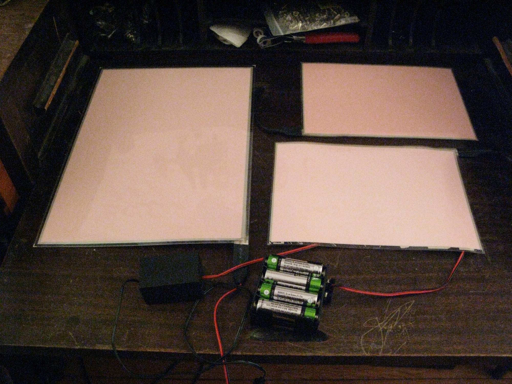
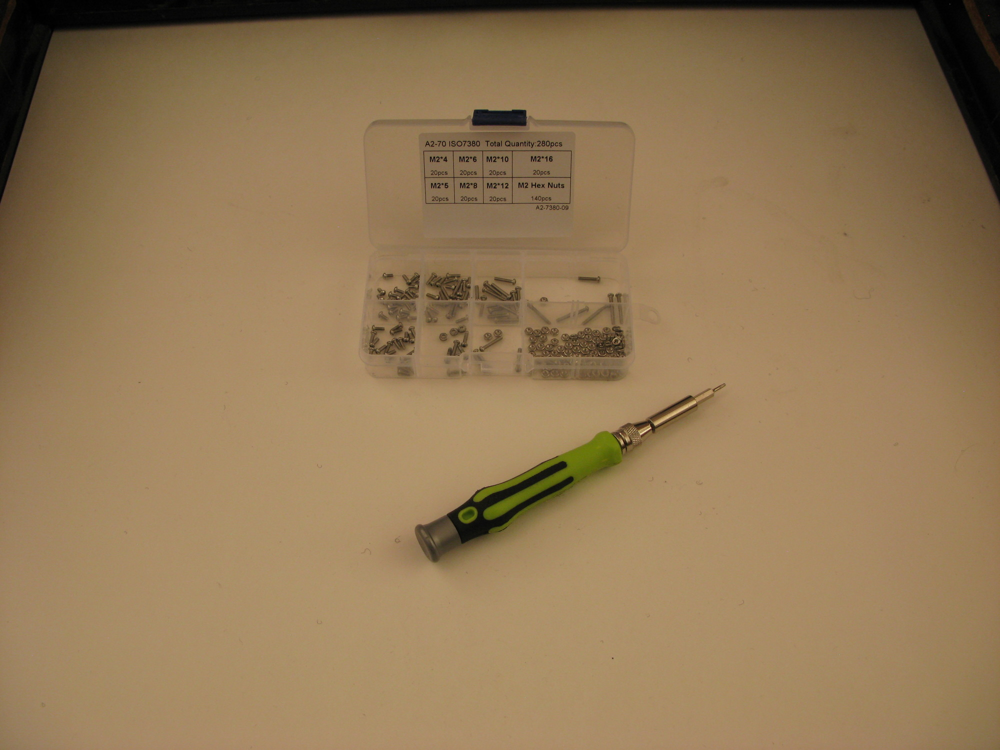
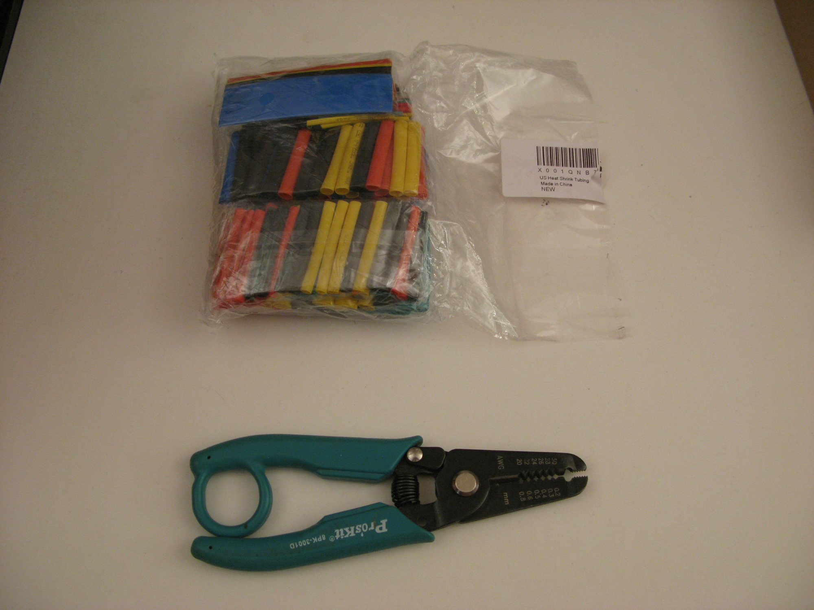
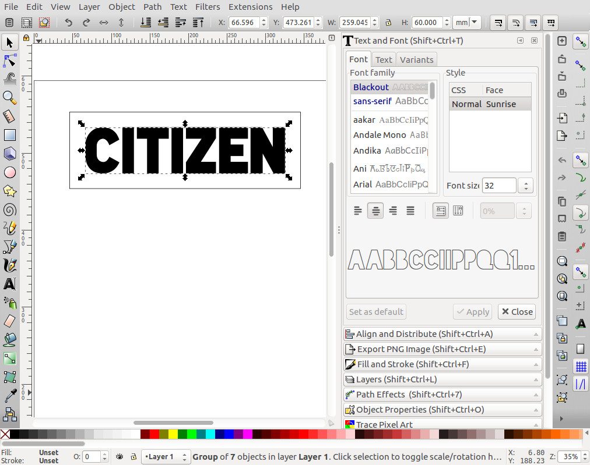

Cyberpunk Jacket
===

| | |
|---|---|
|  |  |
|  |  |

Introduction
---

In order to try and make aesthetically pleasing high tech
fashion more available, we came up with the idea of
creating electroluminescent (EL) patches that can be put
on clothing.
The EL patch glows in the dark and gives a very retro "cyberpunk" feel to jacket.
Though high tech fashion is becoming more mainstream,
there's a lack of stylish clothing that's reasonably
priced.
This project is an attempt to make visually pleasing wearables
more accessible to the public.

The method is versatile enough that you can affix the EL patches
to other pieces of clothing but this instructable will focus
on making EL patches just for jackets.

The total cost is roughly $100, $50 in EL panels, $30 for
the jacket and the rest for miscellaneous cost, such as the
cloth, glue, etc.

The method described in this instructable will be focused
on the workflow used to create the EL panels but can
be altered depending on what kind of access to materials,
software and machines you have.

The basic idea is to laser cut some art, glue it
to an EL panel and then affix it to a jacket with velcro.
The wires are poked through the back of the jacket and wired
through the lining to access the power source
in the jacket pocket.
The patches are semi flexible and act like standard jacket patches.

The patches on the jacket are a bit fragile but can withstand "everyday"
usage.
Protecting the panels from breakage is an ongoing experiment
and the current methods presented below, such as strain relief, are
our current attempts at making the panels more robust against normal
use.

Even though the idea is pretty simple, we think the results look striking.

Step 0 : Materials and Tools
---

* Access to a laser cutter (for cutting the cloth patches) (We use a [K40 40W CO2 laser engraver](https://www.ebay.com/bhp/40w-laser) modified with a [smoothieboard](http://smoothieware.org/smoothieboard) to control the motors and laser).
* Cloth (heavy duty nylon) ([Amazon link](https://www.amazon.com/gp/product/B002C6DAXE/))
* 3 EL panels, 1 A4 size (300mmx210mm) and two A5 size (210mmx150mm) ([Ebay A4 link](https://www.ebay.com/itm/12V-A4-EL-Panel-Electroluminescent-Cuttable-Light-With-Inverter-Paper-Neon-Sheet/292622036778), [Ebay A5 link](https://www.ebay.com/itm/White-A5-EL-Panel-Electroluminescent-Cuttable-Sheet-Neon-Paper-12V-Actuator-US/362404815900))
* EL Extension wires and splitters ([Ebay EL wire extension link](https://www.ebay.com/itm/15-2-way-EL-Wire-Splitter-Cable-Connector-Extension-Line-Decorative-Black-Red/382637753018), [Ebay splitter link, 5way](https://www.ebay.com/itm/5-way-EL-Wire-Splitter-Extension-Cable-Line-Decor-Tool-Female-Connector-Black/312253408137))
* inverter plus batteries and battery pack ([Ebay link](https://www.ebay.com/itm/New-12v-Battery-Box-inverter-for-15-Meters15M-EL-Wire-EL-Panel-EL-Tape-XMAS/322616309101))
* Glue (gorilla) ([Amazon link](https://www.amazon.com/Gorilla-Original-Waterproof-Polyurethane-Bottle/dp/B0000223UV))
* Jacket (Take your pick but we used a Forever 21 cropped faux leather jacket, [example link](https://poshmark.com/listing/Forever-21-Faux-Leather-Jacket-5c326999534ef9b07b6658c3))
* Velcro (heavy duty) ([Amazon link](https://www.amazon.com/VELCRO-Brand-Industrial-Strength-Superior/dp/B00006RSP1))
* Scissors
* (optional) Electrical tape

* Soldering Iron
* (optional) 'helping hands'
* (optional) heat shrink tubing ([Amazon link](https://www.amazon.com/560PCS-Heat-Shrink-Tubing-Eventronic/dp/B072PCQ2LW))
* (optional) heat gun ([Amazon link](https://www.amazon.com/Wagner-Spraytech-0503008-Heat-Gun/dp/B00004TUCV/))
* (optional) wire strippers ([Amazon link](https://www.amazon.com/Multi-Purpose-Stripper-Klein-Tools-1011/dp/B0000302WM))
* Solder
* (optional) solder flux
* (optional) 1/16" thick Delrin or Acetal for strain relief ([Amazon link](https://www.amazon.com/Acetal-Copolymer-Standard-Tolerance-Thickness/dp/B0070ZYI0Q))
* (optional) M2 bolts and nuts, at least 8mm in length (longer is ok) ([Amazon link](https://www.amazon.com/Hilitchi-600-Piece-Phillips-Assortment-stainless/dp/B01N2XYON0))
* (optional) M2 screwdriver
* (optional) blue loctite ([Amazon link](https://www.amazon.com/Loctite-Heavy-Duty-Threadlocker-Single/dp/B000I1RSNS/))

Note that you can use any material for the cloth but not all material
is safe to laser cut.
[Pololu's materials for laser cutting](https://www.pololu.com/docs/0J24/3)
and [ATX Hackerspaces Laser Cutter Materials](http://atxhackerspace.org/wiki/Laser_Cutter_Materials)
are good resources to make sure the material you're laser cutting is safe.
In particular, PVC, vinyl and pleather are all materials that will emit toxic chlorine
gas if laser cut and should be avoided.
Cotton, polyester, nylon, acetal and Delrin are all materials that are able to be cut safely on
the laser cutter.

The cloth above is heavy duty Nylon.
Though Nylon melts in the laser cutter, it's still able to retain a lot of the detail
of the source image.
Since Nylon melts when heated, this helps to make resulting patch more robust as it cauterizes the edge of the fabric
to make a nice seal.

Materials list

  

    
| Description |  |
|---|---|
| jacket |  |
| EL panels (1xA4, 2xA5), inverter and battery pack |  |
| uncut cloth |  |
| sectioned cloth |  |
| scissors, glue, wire extensions, velcro |  |
| soldering iron, solder, flux, helping hands |  |
| M2 screws and nuts with screwdriver |  |
| M2 screws and nuts, screwdriver, loctite, 1/16" acetal sheet |  |
| wire strippers and heat shrink tubing |  |
| helping hands and heat gun |  |
    
  

### Software

The software is optimized for the workflow we've developed but other software
can be used depending on what you're familiar with or what kind of laser cutter
you have access to.

* [Inkscape](https://inkscape.org/)
* [Gimp](https://www.gimp.org/)
* [LaserWeb4](https://github.com/LaserWeb/LaserWeb4-Binaries/)

Inkscape is used to create the vector art for the lettering.
Gimp is used to create the art patch.
LaserWeb4 is used to convert the art patch to GCode to be sent to the laser cutter.

For laser cutters that can take files directly, such as the Epilog Zing, Laser Web 4
isn't needed.

Step 1 : Design Art and Lettering
---

The [art](https://github.com/abetusk/ellemal-data/tree/release/citizen-dark/moth/export/moth_v0.1.6.4.png)
and [lettering](https://github.com/abetusk/ellemal-data/tree/release/citizen-dark/moth/export/) are available
on the [GitHub page for this project](https://github.com/abetusk/ellemal-data/tree/release/citizen-dark/moth).
If you'd like to use the art already created, you can proceed to step 2.

The first step is to get a general sense of the design and pick out art
to be used in the patch.
We wanted a modern occult look with a moth as the centerpiece.
[Archive.org](https://archive.org) has a massive database of public domain
texts and art.

We searched Archive.org for old texts from the 1800s and before.
We found a good filter was to look for natural history texts with
illustrations.
We found we had the best results with laser cutting the art when the original
piece was hand drawn or woodcut.
Photographs often have too much detail that lead to artifacts and noise
in the final stencil.

Once we decided on a source picture, we downloaded a large resolution of the image
and imported it into Gimp ([Archive.org link to original picture](https://archive.org/details/amongmothsbutter00balluoft/page/122)).
We cropped it, converted to a black and white image and then did a threshold on
it to make it as close to a two color stencil as possible.

We added some other effects, like a triangle that inverts the base moth image,
a dotted circle and an stylized eclipse at the bottom (taking as source
material another [Archive.org link to a lunar eclipse](https://archive.org/details/lesmerveillesc00flam/page/328))

The white pixels will be 'burned' by the laser cutter.
This means that any 'islands' of black surrounded by white will fall out.
These islands should either be removed or, if important to the design, be attached
to a connecting region.

Care has to be taken to reinforce thin black lines as a high powered laser
will obliterate the line.
We found that reinforcing thin black lines to be at least 2-4 pixels wide
with 2-4 pixels spacing between other black regions, worked well.
This is dependent on image resolution and final physical design size,
so this might need a few iterations to determine which regions to
reinforce and by how much.
We also added some 'noise' to the wings by choosing a "noisy" brush
and added some jitter to give some randomness.
This extra noise helps reinforce the material as the laser won't burn the
portions that are dark.

Once the art piece has been cleaned up, we export to PNG format and
import the PNG into LaserWeb4.

The parameters in LaserWeb4 were tailored to the laser cutter
we have access to.
In our case, the laser cutter cut speed was set to `4999 mm/min`,
with the `Burn White` option unselected and the `Invert Color` option selected.

The PNG image in LaserWeb4 is resized to the desired final size.
In our case, this was mostly limited to the bed size of the laser cutter,
which has a maximum work area of roughly 7 inches in height and 11 inches in width.

Once we're happy with the set parameters and sizing, we export the image to GCode
and save it.

With the art exported into GCode file, we move our attention to creating
the lettering.

We used Inkscape to create the lettering.
If the font desired already exists in Inkscape, that can be used,
otherwise, additional fonts [can be added](https://www.youtube.com/watch?v=7RwzeGewLEo).

We decided on [The League of Moveable Type's font called Blackout](https://www.theleagueofmoveabletype.com/blackout).
We find the Blackout font aesthetically pleasing and has a nice
feature that there are no 'islands' in each of the characters.
For example, normally 'O' and 'A' characters have an island the would
need to be secured or removed.

Using the Blackout font, we created the two words we want in our design,
"CITIZEN DARK", and export each to an SVG file.

The Blackout font has two paths per letter, one that represents the outside
and the other for the inside.
In order to only cut one path, the inside path for each character was removed.

We chose to display metric units for Inkscape and resized the lettering large enough
to cover most of the back of the jacket but small enough to fit within
the laser cutter bed.

Each word was placed within a bounding rectangle.
This rectangle will be cut by the laser cutter and represents the bounds of the
patch lettering.

In our case, this was making the lettering 60mm in height with a 20mm border on each
side for the box, giving us 100mm for the total height and just under 260mm for the visible
portion of the longest word ("CITIZEN") with the total size of the longest text patch
being 300mm.

Using a custom script (called [svg2ngc](https://github.com/abetusk/ellemal-data/tree/release/citizen-dark/lettering/export/svgn2nc)), we converted the SVG file to a GCode.
The parameters used were `8000 mm/min` for rapid speed, `1500 mm/min` for cutting speed and full power
for the laser (in our case a 40W CO2)

Once we have the three GCode files, one for the art and the other two for each
word of the lettering ("CITIZEN DARK"), we are ready to cut the cloth.

Step 2 : Cut Design on Laser Cutter
---

K40 laser cutter

  

| |
|---|
|  |
|  |

  

For each design, a large piece of cloth is initially cut with scissors
and placed on the laser cutter bed.
The size of the cut cloth needs to be larger than the pattern to be cut but
should be small enough to fit within the confines of the laser cutter bed.
The fabric should lie flat on the bed.
Taping the fabric on it's edges onto the laser cutter bed
can help to make sure it's secured firmly.
If the fabric needs securing, whatever method used should not obscure the
cut area.

We chose nylon cloth that is thick so we left the laser cutter power at full
(as chosen in the GCode conversion in LaserWeb4 above).
If cutting thinner cloth, a high power on the laser cutter might lose detail but
for the cloth we use, this is not a concern.
If cutting with a laser cutter that has a different power rating or cloth with
a different thickness, you should adjust the power of the laser cutter
and the speed accordingly.

Each GCode file is sent individually to the laser cutter to be cut.
If the cut isn't the quality that you want, the original artwork
might need to be altered to accommodate.
Options for troubleshooting bad cuts this will be dependent on the art,
the laser cutter and the materials being cut.

Some common options to improve the cuts are
reinforcing thin black lines in the original art,
altering the laser cutter power and changing the cut laser cut speed.

Once each piece is cut on the laser cutter, carefully remove
the work from the bed, making sure not to damage the interior
detail.

Step 2.5 (optional) : Cut Strain Relief
---

A common failure of the EL panels is the disconnection of the
power lines to the soldered joints on the panel.
To help mitigate this failure mode, a strain relief is put on
the ends of the panels to help take the load off of where the wire
connects to the panel.

The EL panels will still work without this strain relief, they
just might fray with repeated use.

The strain relief can be cut on the laser cutter but with Acetal
or Delrin as the material.
Each strain relief object consists of two pieces that are screwed
together by 6 M2 screws.

The wire coming out of the EL panel should be wrapped around and then
fed through the middle of the two pieces.
The end of the panel as well as the wire coming out of the strain relief
are sandwiched between the two pieces and kept securely in place
by tightening the M2 screws.

To make sure the strain relief hasn't caused any problems,
test the panel to make sure they still light up.
If the panel didn't light up, try loosening the strain relief to see
if it inadvertently caused a short or pierced the plastic.

Step 3 : Cut EL Panels and Rough Patch Alignment
---

Once the cloth portion of the patches has been cut, we can now
start cutting the EL panels to fit the cloth patches and align them
to the jacket.

Cutting the panels is a little dependent on the placement in the back of the jacket.
We want to make the access cuts on the back of the jacket as innocuous as possible,
so we'll want to cut the EL panels so they'll place well on the back of the jacket.

The basic workflow is to get a sense for where the patches will be on the jacket,
along with where the access holes need to be cut.
Once we're happy with positioning, we can cut the EL panel and make sure it
can be placed well on the back of the jacket.
We'll go back and forth between spot checking placement on the back of the
jacket, cutting the EL panel, making sure the cloth can be aligned over
the EL panel and cutting access holes in the jacket.

Place the patches as best you can on the back of the jacket and block
out where they'll be with masking tape.
The masking tape will be used as guides when doing final placement.
There should be a bit of leeway in positioning the patches so it doesn't need
to be highly accurate.

Align the EL panel on top of the back of the jacket where it will finally go,
aligning it to the masking tape registration marks.
Put the cloth portion over it to get a sense for where the cloth portion
will overlap the EL panel.

We've found that overlaying masking tape on top of the EL panel, so we can mark it
with a pencil without worrying about dirtying the lit area, works well.
Make sure to turn on the EL panel when placing to make sure the cloth positioning
and eventual patch positioning is being done in the region of the EL panel that
actually lights up.

Trace out the portion to cut on the masking tape.

Once we've decided where to cut, cut the EL panel with scissors.
**Don't cut the EL panel while powered. Power off the EL panel while
cutting unless you want to get a shock.**
When cutting the EL panel with scissors, you want to make sure not to
twist or bend the panel, scissors or shear line where you're cutting.
We want to keep the top and bottom layer of the plastic coating on the
EL panel as undisturbed as possible to make sure there's a solid connection
so the whole panel can fluoresce.

We want to leave a portion of the EL panel available so that it can go into
a cut access hole in the back of the jacket.
In the image, you can see a long "trace" of EL panel that will feed into
the access hole in the back of the jacket.

Once the panel is cut, place the cloth patch over to make sure it looks good.
Make sure to do placement like this with the EL panel on as it's sometimes hard
to tell where the panel's light boundaries are.

Cover the strip with electrical tape to reinforce it and make sure there's minimal light bleeding
outside of the area we're interested in.

Remove the masking tape if need be and do a final spot check to
make sure the patch looks good.

We'll now cut an access hole in the jacket and do some spot checks to make
sure the panels still can be positioned where we want them to be.

First cut an access hole in the jacket to feed the EL panel strip through.

Once the access hole is cut, we can feed the EL panel through and do a spot
check to make it can still be placed where we want it to.

Once this is done for the "DARK" patch, do the same for the moth patch and the "CITIZEN" patch.

To get a better handle on where to cut the access hole, you can use
masking tape and some marks.

Now we have a good idea that the patches can be aligned and placed
on the back of the jacket, it's time to glue the cloth portion
to the EL panel and place them in their final position on the jacket.

Step 4 : Glue Cloth onto EL Panels
---

Before gluing, do a rough spot check to make sure everything is aligned and looks good.

Once we're happy with the rough placement, it's time to glue the cloth portion
to the EL panel.
The synthetic material along with the plastic on the EL panel means that not
all glue will work well.
We've found Gorilla glue to be a decent choice though you should feel free to
experiment.
Glue that has not worked is Elmer's glue and superglue.

Put a thin layer of Gorilla glue on the region of the cloth that will be over the EL
panel.
Don't put too much as the Gorilla glue will expand and be messy.
Try to get the thin regions of the cloth as they'll tend to flop around.

Now affix the cloth to the EL panel and wait for the glue to dry.
Do fine adjustments, with the EL panel turned on, to make sure the cloth
placement looks good.

If you can, put something on top of the cloth to try and provide some pressure.
Don't worry about the glue being messy.
Though little glue spots are unseemly, in low lighting and when the panel is lit
up, they're not noticeable.

Gorilla glue takes 2-4 hours to be dry enough for handling.
Glue each cloth panel to its corresponding EL panel and let it dry.

Once all three patches are dry, we'll be ready to do the final placement on the back of the jacket.

Step 5 : Add Inverter and Connect EL Patches
---

Since the glue takes a while to dry, we can do add the inverter to the inside of the lining of the jacket
while we wait.

The first thing to do is to cut a hole in the lining on one side of the jacket.
Different jackets have different pocket options so you'll have to be creative on where you
want this to be placed but it's probably better to have the hole in the lining cut close
to the pocket where the inverter and battery pack will reside.

This access will serve as a way of putting the inverter into a side pocket, allowing access to the battery
pack so that the batteries can be replaced and allow for your hand to go through the lining and back jacket
interface to connect the panels to the inverter.

You can wave a lighter over the cut area of the lining to singe the frayed ends (be careful you don't catch
anything on fire).
You can also place a velcro patch on either side of the lining so that it will stay closed.

Now put some velcro on the inverter and on the inside of the lining, where the inverter will be placed,
so that it stays in place.

Whatever pocket there is, make sure the inverter can be accessed through it so the panels can be turned on and
off without having to open up the side lining.

Step 6 : Solder Wire Extensions
---

This step might be optional depending on how long the wires are on your EL panels, inverter
and wire splitters.
Often the EL panels don't have long wires coming out of them so they need to be extended to be able
to reach the wire splitter that eventually runs to the inverter.

The extension will be wiring a male and female connector together, making sure to match colored wires.
Strip the ends of the wires and wrap them around their corresponding mate, making sure to put
heat shrink tubing on the wire before wrapping them together.

Use the helping hands to hold the wires in place, put some flux on the exposed wires and solder them
together.

Once soldered, move the heat shrink tubing over the exposed soldered joint and use the heat gun to shrink the tubing.

These wires can be used to extend the EL panels should the wires that come out of them be too short
to connect to the wire splitter.
Test each on an EL panel to make sure the solder joint is good.

Step 6 : Affix EL Patches to Jacket
---

Once the glue is dry on the patches, it's finally time to put them in their final place on the jacket.

First place velcro on the back of the EL patches.

Feed each of the patch strips through the access holes in the back of the jacket.

Expose the other end of the sticky back of the velcro.

Firmly press down on each patch to make sure the velcro sticky back finds purchase and wait
till the velcro glue sets up.

Once things are in place, wire each of the panels through the wire splitter and finally to the inverter.
Test to make sure the jacket still lights up.

Hopefully everything should have worked and you should have a working cyberpunk jacket!

Step 7 : Wear It!
---

Troubleshooting
---

There are some common failures that tend to occur:

### Nothing lights up!

* Check all wire connections, both in making sure they physically look connected and that they have continuity.
* Check to make sure the batteries are all connected in the battery pack and that they
  have charge. Make sure the battery pack is connected to the inverter.
* Check the inverter works (either by swapping it out or testing it on another panel). Often inverters die.
* Check each of the panels individually with another inverter or battery pack to make sure they work in isolation.

As with any troubleshooting, the purpose is to determine where the problem is.
Is it happening after the battery pack or before?
Is it happening after the inverter or before?
Is it happening at the EL panel or before?

Try to do the simple test to figure out where the problem is generally so you can drill down to where the problem
is occurring specifically.

Finding out where the problem is will tell you whether you need to change the batteries, resolder connections, replace
the inverter or replace the panel.

### A single panel doesn't light up!

* Check to make sure the panel is connected to the wire splitter or inverter.
* Test the EL panel individually to see if it's a problem with the panel or something else before coming to the panel.

If it's not the inverter or connecting wires, this might mean the panel itself has failed.
Some common failures we've seen are:

* The solder joints where the wires connect to the panel fray off (which is why we tried to put some strain relief on them),
* The connecting EL 'strip' gets bend and breaks the connection to the rest of the panel.
* Cutting the panel, soldering onto the panel or screwing through the panel causes a short and the panel doesn't work.

Most of these are catastrophic failure conditions and only rarely does the EL panel not need to be replaced.

### A single panel lights up intermittently or flickers!

This is most often due to a frayed or loose connection.
Do the obvious checks of making sure the connections are secure from the EL panel to the wire splitter
and that the connecting wires have good continuity.

In most cases, though, this means the EL panel will most likely need to be replaced.
We've had some success in resoldering connections to the EL panel but this needs to be done with
care as the plastic sheets sandwiching the EL paint are conductive and a mis-solder on where the wire connects
to the panel might cause a short, rendering the EL panel useless.

### The Inverter Emits a High "Buzzing"

Most inverters we've used have a high pitched 'whine', which is normal, but occasionally when inverters fail, they
start to "buzz", which sounds different from their normal whining.
This usually means the inverter is malfunctioning or dying and probably needs to be replaced.
It might inconsistently light up the panels, or dimly light up the panels, which is another symptom that the
inverter is dying.

### The Inverter Emits a High Pitched Whine

This is normal.

EL panels operate by pushing a high voltage, high frequency alternating current signal across the EL paint
to fluoresce.
The originating power source is coming from a 12V DC battery pack (from 6 AA batteries).
This means the the 12V DC current needs to be converted to around a 100V 1000Hz signal.

The 1000Hz signal sounds to most people like a high pitched whine.
I've heard that the culprit in most inverters is a capacitor that resonates at that frequency which is
why the whine is audible.

The good news is that the inverter is covered by the jacket and even modest background noise (at a club, in a bar, normal conversation) will make the inverter whine unnoticeable.

References
----

* ['Among the moths and butterflies: a revised and enlarged edition of "insect lives ; or, Born in prison"' (pg. 122)](https://archive.org/details/amongmothsbutter00balluoft/page/122) by Julio P. Ballard (Julia Perkins).
* ["Les merveilles celestes, lectures du soir" (pg. 328)](https://archive.org/details/lesmerveillesc00flam/page/328) by Camille Flammarion.
* [Dryocampa imperialis](http://dpr.ncparks.gov/moths/view.php?MONA_number=7715.00)
* [Blackout font by The League of Moveable Type](https://github.com/theleagueof/blackout)

License
---

All art, code and other content, unless explicitly stated otherwise, is available under a
Creative Commons Zero license ([CC0](https://creativecommons.org/share-your-work/public-domain/cc0/))

Please use these design, art and all source files in this directory as you wish.
Credit is appreciated but not necessary.

