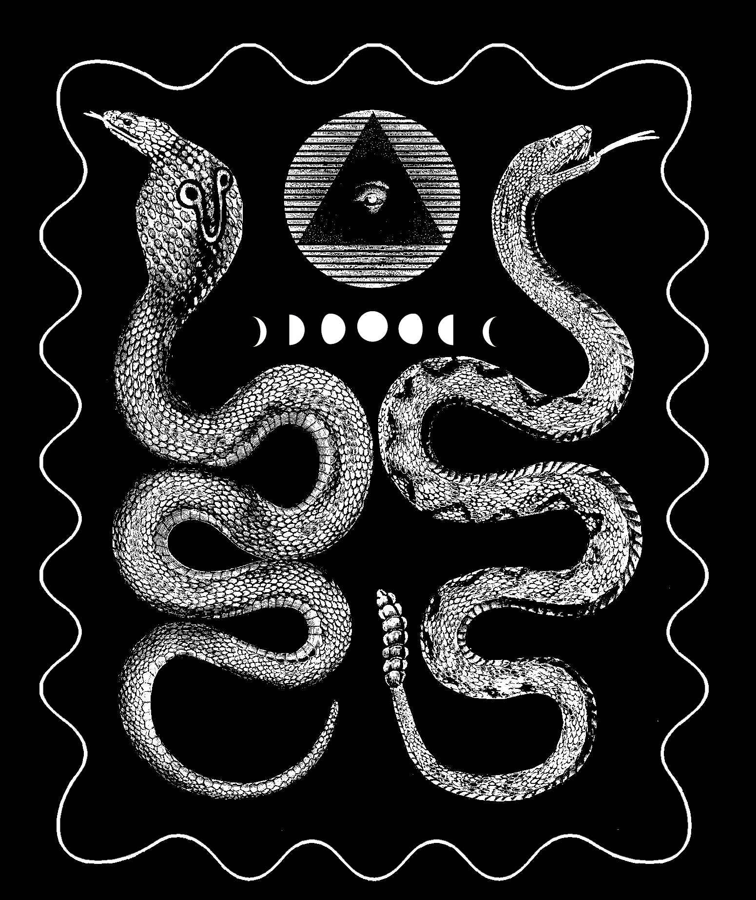

Snake Pair
===

"Snake Pair" patch.



Export Notes
---

For each destination patch size, the image needs to be rescaled and the GCode regenerated.
The borders of the picture are black so the scale needs to account for the border to make
sure the portions of the image that are being cut are the proper size.

Using [LaserWeb4](https://github.com/LaserWeb/LaserWeb4), import the
`png/snake-pair-border.png` image (or whatever the most current/desired image is).

The parameters I'm using are:

* rotate the image by 90 degrees
* Laser Power `Min 0`, `Max 100` (percent `%`)
* 1 Pass
* Laser Diameter `0.2` (`mm`)
* Cut Rate of `4999` (`mm/minute`)
* **Unselect**  `Burn White`
* **Select** `Invert Color`

Here are the parameters I used to rescale:

| Destination patch size | Rescale (X) size |
|---|---|
| 100mm | 115mm |
| 150mm | 140mm |
| 210mm | 210mm |
| 300mm | 430mm (?) |

After each rescale and GCode generation, the image is saved into a file called
`snakepair_s<size>.ngc`, where `<size>` is the destination patch size.

Each needs to be 'cleaned' to take out extraneous content that LaserWeb4 generates
and to reposition so the work starts at the `(10,10)` (`mm`) mark.
The script `cleanup.sh` does this automatically, altering the GCode file in place.

Here is an example usage of the `cleanup.sh` script:

```
./cleanup.sh snakepair_s100.ngc
```

Note that the `cleanup.sh` script requires `grecode` and `dos2unix` to function properly.

Credits
---

* [Snakes](https://www.biodiversitylibrary.org/item/133381#page/72/mode/1up)
* [Moon Phases](https://commons.wikimedia.org/wiki/File:Moon_Phases.svg)
* [Eye](https://archive.org/details/regvlaemblematic01bene/page/n83)

License
---

All files in this directory, unless explicitly stated otherwise,
are under a [CC0](https://creativecommons.org/share-your-work/public-domain/cc0/) license.

Credit is not necessary but appreciated.


