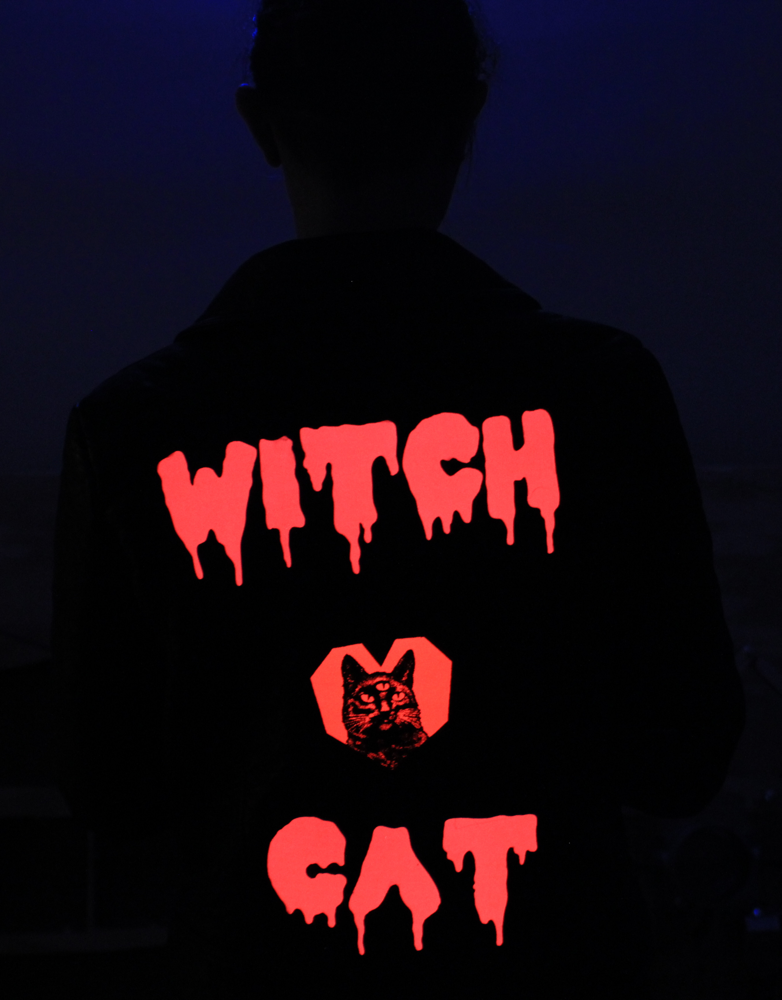

Witch Cat
===

A witchin jacket for the practicing witch cat.

Overview
---

The 'witch cat' jacket consists of 3 electroluminescent patches affixed to the back of a jacket via
adhesive velcro.
The wires for the EL panels are wired through the back of the jacket through cut holes and in between
the outer jacket skin and the lining to protect the wearer from scratches from the routed wires.

The wires are routed through a multi-connector to feed into a single inverter that has the capacity
to power all three panels.
The inverter is put into a side pocket, with a hole punched through the pocket lining to connect
to the routed wires in the jacket.

Notes
---

* To alleviate strain on EL pnael connections, a strain relief piece is put on the ends.
* The `WITCH` is longer than the A6 panels used, so two A6 panels were put together, cutting
  each so that the 'seam' would be underneath the fabric patch in between the `WIT` and the `CH`.
* See lettering for more details on the lettering specifics. I believe the outline was combined
  with the lettering using [LaserWeb4](https://github.com/LaserWeb/LaserWeb4/wiki).

License
---

All images, source code and data files, unless otherwise explicitely stated, are under a CC0
license.

Creative Commons Zero ([CC0](https://creativecommons.org/share-your-work/public-domain/cc0/))

Please use this design, art and all source files in this directory as you wish.
Credit is appreciated but not necessary.

