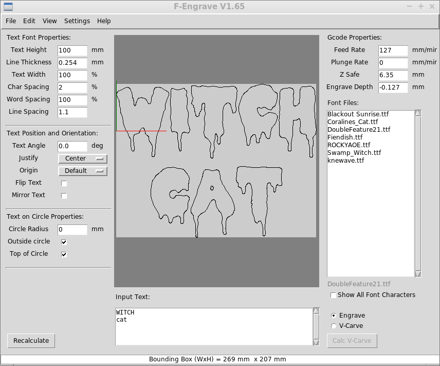

"Witch Cat" Lettering
===

Using [F-Engrave](http://www.scorchworks.com/Fengrave/fengrave.html) with
[Double Feature](http://www.fontspace.com/david-shetterly/double-feature) by David Shetterly
licensed as SIL Open Font License (OFL).

* `100 mm` for text height
* `2%` character spacing
* roughly `270 mm` for the upper text width and about `180 mm` for the bottom text width

Interestingly, the `Double Feature` font has different drip patterns for different cases,
so you can use different capitalizations to provide different types of text.

For my laser cutter, I need to give it some spacing on the left and bottom so I use
`20 mm` as the `X Offset` and `60 mm` as the `Y Offset` in `F-Engrave -> Settings -> General Settings`.

`F-Engrave` was meant for CNCs, so there's some post procssing that needs to be done to
make sure that it can be used on my laser cutter.
Another option is to use `Laser Web 4` and import the SVG but I'm going to manipulate
the GCode directly.

Another consideration is that there needs to be a bounding box to encapsulate the text.

The `A5` panels are roughly `210 mm x 150 mm`.
I'm planning on using on full panel for the `cat`, laid out horizontal.
I'm planning on using two panels, maybe trimmed, to cover the `witch` text.

[Sinister Fonts](http://www.sinisterfonts.com/) has some free/libre options that are also
candidates:

* [Fiendish](http://www.sinisterfonts.com/DL2010/Sinister-Fonts_Fiendish.zip)
* [Swamp Witch](http://www.sinisterfonts.com/DL2010/SwampWitchFont_by_SinisterFonts.com.zip)
* [Coranline's Cat](http://www.sinisterfonts.com/DL2010/Sinister-Fonts_Coralines-Cat.zip)

But I still think the `Double Feature` is the best.

References
---

* [F-Engrave](http://www.scorchworks.com/Fengrave/fengrave.html)
* [fontspace.com](http://www.fontspace.com)
* [DoubleFeature21 font](http://www.fontspace.com/david-shetterly/double-feature)

