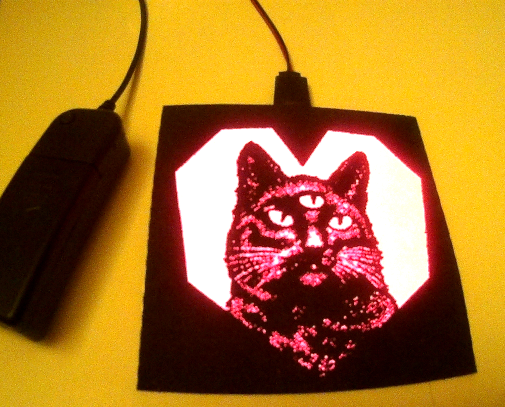

Cat "Patch"
===

These files were used to create an "EL" patch.



The final `png` used is `png/3cat-hart-se-outline.png`.


The `GIMP` file is provided in `gimp/3cat-hart.xcf`.
My computer crashed while playing with the source file
so the original `xcf` was lost.
The intermediate `png`s were saved and that's what's
present in the `xcf` file.

The steps to create the `png` from `GIMP` were:

* desaturate
* dilate to open up some of the whiter areas
* threshold
* "fill in" edges and other areas with black to
  ensure a contiguous connected region, reinforced
  edges and no edges that were too thin
* use a top layer to test which 'heart' pattern
  looked good
* clone some of the stipple pattern on the chest so the
  underside of the "heart" will be visible instead of fading
  to black completely.
* "open" up the eyes to make them bigger by cloning the interior
  and "pushing" the edge out a bit.
* copy and paste one of the eyes (the left is what I used I think)
  and use the clone tool to blend the edges of the copied and rotated
  rectangle.
* create new `png` and put a 10 pixel white square outline
  around it.
* export the `png`

Once the `png` was exported, I used [LaserWeb4](https://github.com/LaserWeb/LaserWeb4)
to convert the `png` to `GCode`.

The parameters I used were

* laser "power" to `25` (out of `100`)
* speed set to `3000` (presumably 3000mm per minute)
* do not etch white pixels
* invert selection
* scale the image to be around 110mm by 110mm, the size of the
  EL panel I was using.
* shift the image so it's lower left corner was at the 15mm,15mm mark

Setting power to be full is too intense and will either lose detail or
make the work catch on fire.
Setting the speed to be too slow will lose detail or catch the work on
fire.
You must skip white pixels or everything will be etched, creating an
empty square.
Invert the selection or the black will be etched instead of the white.
The EL panel can be cut down but it's nicer, and easier, to use the
whole EL panel if possible.
Shifting is for my machine to make sure it's far enough away from the edge
so it's not etching the laser cutter armature and triggering the limit
switches.

`LaserWeb4` can be a bit clunky to use but it's by far the simplest, most
versatile and functional piece of software that I've found for this purpose.
To start, you need to `Add Document` in the `Documents` portion.
Once you've added your `png`, you need to drag the file under the `GCODE`
region where it says `Drag document(s) here to add`.
Once the file is dragged, the parameters for the `GCode` file can be set.
A feed rate is required and it won't let you render until it's specified.
Set the options as listed above and then hit the `Generate` button next
to the `GCODE` heading.
You can then hit the green "save" button (an ancient floppy icon) to save
the `GCode` file to your desktop.

The resulting `GCode` file has some cruft in it, so I use the following
post processing to clean it up:

```
$ dos2unix out.gcode
$ sed -i 's/;.*//g' out.gocde
$ sed -i 's/  *$//g' out.gocde
```

To get rid of the Windows "control, line feed" cruft, get rid of the
comments (which some GCode parsers understand and others don't) and
finally, just as an aesthetic issue, remove trailing whitespace.

I'm using a K-40 (40W) "Chinese" laser cutter outfitted with a smoothieboard.

Misc.
---

* Since the raster is directional, the edges of the square might cut better in
  one direction than the other.  For example, they might cut cleanly horizontally
  but not vertically.  This is why the choice of 10 pixels came in as the previous
  iteration only had 5 pixels and turned out to not cut cleanly.
* Make sure to take the protective coating off of the EL panel before you glue the
  'patch' on.
* I don't know if it's the best for this purpose, but I'm using G-S HYPO CEMENT
  with a G-S PRECISION APPLICATOR ([amazon link?](https://www.amazon.com/Precision-Applicator-Adhesive-Detailed-Findings/dp/B00C7PA7UY)).  The small applicator is good at getting the
  glue in between fine detail.
* I use 'dots' of glue around instead of trying to 'smear' it.
* Get close to the edge or else it will 'flap'.
* Use black tape to cover up the top tab if it's still visible.
* You can push the patch around on the EL panel a little to do fine adjustment
  while the glue is still wet.
* I believe I used heavy duty Nylon ([amazon link?](https://www.amazon.com/gp/product/B002C6DAXE)).
  It feels pretty durable and doesn't disintegrate when a bunch of holes.
  It does melt but if the laser is set right, it's not too bad and the melting on the edges
  can even be a benefit.
  Part of the cloth is shiny but often the patches will be seen
  in low light conditions so it shouldn't' be much of an issue.
  The solid portions of the fabric completely block out the light from the panel underneath.
* Nylon is on the list of acceptable laser cuttable materials from
  [Pololu's "Materials for Laser Cutting](https://www.pololu.com/docs/0J24/3) page.

Inspiration
---

The original art for the cat falls under the public domain and is taken
from Wikipedia.
The original art is an advertisement for "Black Cat Cigarettes" which has since been
bought out and decommissioned.

The "three eyed cat" is a well established idea on the internet by now.

The heart shape was influenced by doing a Google search on "minimalist geometric heart"
but was otherwise draw "freehand" in GIMP by [abetusk].

References
---

* [Black Cat Virginia Cigarettes, Extra Mild-Quality Superfine (yellow)](https://commons.wikimedia.org/wiki/File:Black_Cat,_Verginia_cigarettes_pack,_pic1.JPG) (CC0)
* [Black Cat Virginia Cigarettes, Extra Mild-Quality Superfine (blue)](https://commons.wikimedia.org/wiki/File:Black_Cat_-_Extra_Mild_cigarettes_pack,_pic1.JPG) (CC0)
* [G-S Hypo Cement Precision Applicator Adhesive Glue](https://www.amazon.com/Precision-Applicator-Adhesive-Detailed-Findings/dp/B00C7PA7UY)
* [Heavy duty Nylon](https://www.amazon.com/gp/product/B002C6DAXE)

License
---

Everything in this directory is licensed under CC0, unless explicitly stated otherwise.


